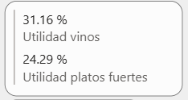
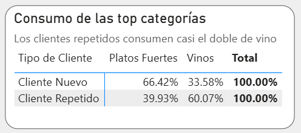
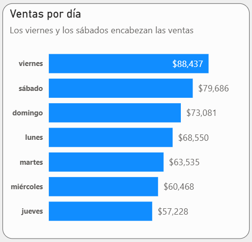
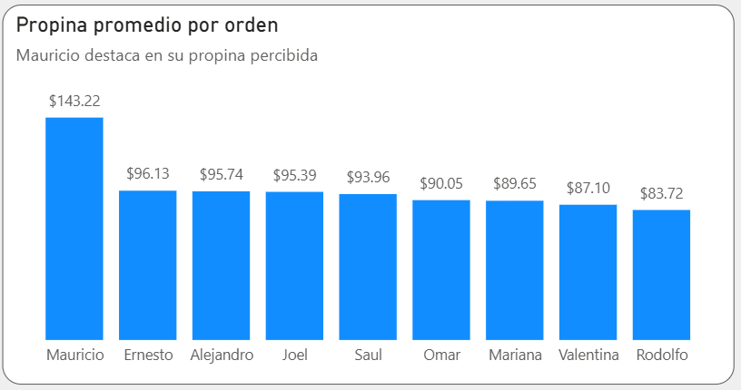

# restaurante-analytics
An exploratory data analysis (EDA) of restaurant sales data using Python and PowerBI; outputs and recommendations are included.
## Table of contents
- [About](#about)
- [Objective](#objective)
- [Data set](#data-set)
- [Key findings](#key-findings)
  - [Profitability](#profitability)
  - [Inventory stock](#inventory-stock)
- [Recommendations](#recommendations)

## About
The dataset contains information on restaurant sales, dates, costs, waiters, tips, orders, product categories, subcategories, key products, and different branches.

## Objective
The analysis has the following goals:

**1. Can the business grow profitability without an increase in the number of dishes sold?** 

**2. When is the best time to restock inventory to prepare for the busiest operating days?**

## Data set
A very brief data set description is provided in order to support following findings concerning the data. It contains:

* sales
* costs
* waiters
* dates
* orders
* product key
* product category
* product subcategory
* tips
* branches

For a detailed data analysis, please go to 'Data Analysis' folder

## Key findings
According to the analysis, the key findings are the following:

### 1. Profitability
#### 1.1 Sales outliers
Of total sales, 6.4% correspond to outliers sales, and from these, 71% are related with wines. Outliers where measured using IQR. Wines report a 31.08% profit margin, while main courses just 24.18%.

#### 1.2 Customer patterns
Busiest days are weekends with most of sales on fridays and saturdays. Also, in those days there are most new customers which besides give more tips than regular ones. 

#### 1.3 Wine consumption by customer type
However, this kind of customers _do not consume as much wine as regular customers do_: from main courses and wines, regular customer consume is almost twice more (60 %) of wine than new curtomers (33 %).

### 2. Inventory stock
Weekends are the busiest operating days and also generate significant wine sales. Therefore, inventory levels should be reviewed and replenished before the weekend to reduce the risk of stock shortages during peak operating days.

### 3. Waiters
#### 3.1 Tips amount
Mauricio got the highest total tips among all waiters, ranking first. Although this is a remarkable achievemnt, he hasn't sold any wine and got no regular customers. Also, Mauricio has the lowest amount of orders among all waiters.

#### 3.2 Average tip amount per order per waiter
The average tip amount per order is $96.22. Mauricio, has an outstanding average tip amount per order of $143.22, and still got less orders amount than any other. This confirms the necessity of further investigation on Mauricio's sales strategies

## Recommendations

Based on these findings:

* Ensure sufficient inventory levels before Friday and Saturday.
* Consider strategies to increase wine consumption among new customers.
* Consider prioritizing wine sales in sales strategies.
* Further investigate Mauricio's sales patterns, because neither wine sales nor regular customers, may indicate relevant behavior specially having the lowest amount of orders.
